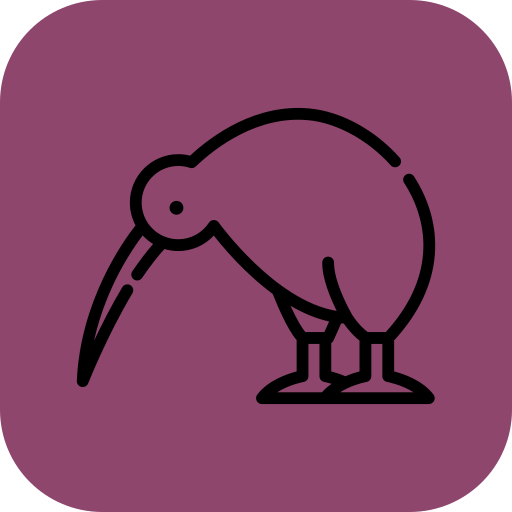

# Kiwi Photo Library

<div align="center">
  
  <p>A simple web app to browse your <strong>Eagle</strong> photo library.</p>
</div>

---

## What is Kiwi?

Kiwi lets you browse folders, tags, and photos from an existing **Eagle** library (a `.library` folder) in your web browser. 

---

## What you need

- **[Docker](https://docs.docker.com/get-docker/)** with **Docker Compose** — the recommended way to run Kiwi (Windows, Mac, or Linux)
- An **Eagle library** already created in Eagle (a folder ending in `.library`)
- Eagle can stay installed on your computer; Kiwi reads the same files

---

## Quick start (Docker)

### 1. Install Docker

Install Docker for your system:

- **Windows / Mac:** [Docker Desktop](https://docs.docker.com/get-docker/) is the usual installer
- **Linux:** Docker Engine + Compose plugin ([install guide](https://docs.docker.com/engine/install/))

Make sure Docker is running before you continue.

### 2. Get Kiwi

Download or clone this project to a folder on your computer.

### 3. Point Kiwi at your Eagle library

Open `docker-compose.yml` and edit the library volume to your `.library` folder.

**Windows** (use forward slashes):

```yaml
volumes:
  - ./data:/app/data:rw
  - C:/Users/YourName/Pictures/MyPhotos.library:/app/data/libraries/MyPhotos.library:ro
```

**Mac:**

```yaml
volumes:
  - ./data:/app/data:rw
  - /Users/YourName/Pictures/MyPhotos.library:/app/data/libraries/MyPhotos.library:ro
```

**Linux:**

```yaml
volumes:
  - ./data:/app/data:rw
  - /home/yourname/Pictures/MyPhotos.library:/app/data/libraries/MyPhotos.library:ro
```

`./data` holds your settings (`config.json`) and photo index. The Eagle library stays a separate read-only mount under `data/libraries/`.

To find your library path in Eagle: **Library → Manage library** — the folder shown there is what you need.

### 4. Start Kiwi

Kiwi runs from pre-built images on [GitHub Container Registry](https://github.com/sr-patel/kiwi/pkgs/container/kiwi-backend) (`ghcr.io/sr-patel/kiwi-backend` and `kiwi-frontend`). No local build is required.

**Windows:** double-click **`docker-start.bat`**

**Mac / Linux:** from the Kiwi folder:

```bash
docker compose pull
docker compose up -d
```

### 5. Open the app

Go to **http://localhost:3000** and follow the setup wizard.

---

## First-time setup in the browser

1. The setup wizard opens automatically.
2. Choose your Eagle library folder (use **Browse** — it appears under the libraries path you mounted in Docker).
3. Wait while Kiwi indexes your photos (a progress message is shown).
4. When finished, browse folders in the sidebar on the left.

**Important:** In the wizard, pick the path **inside the container** (for example `/app/data/libraries/MyPhotos.library`), not your host path like `C:\...` or `/Users/...`.

---

## Daily use

| Action | What to do |
|--------|------------|
| **Start Kiwi** | Ensure Docker is running, then `docker-start.bat` (Windows) or `docker compose up -d` |
| **Browse photos** | Open http://localhost:3000 |
| **Stop Kiwi** | `docker compose down` in the Kiwi folder |

Kiwi keeps your library in sync automatically when you add or change photos in Eagle.

---

## Help & troubleshooting

**The page will not load**
- Is Docker running? (`docker info` should succeed)
- Did you start Kiwi? (`docker-start.bat` or `docker compose up -d`)
- Try http://localhost:3000 after waiting 30 seconds

**I cannot find my library in the setup wizard**
- In Eagle: **Library → Manage library** to see where your `.library` folder lives
- Make sure that folder is mounted in `docker-compose.yml`
- Restart containers after editing `docker-compose.yml`

**Photos are missing or out of date**
- Kiwi syncs changes from Eagle automatically
- For a full refresh: open **Dashboard → Database Maintenance → Run Full Rebuild**

**I changed the library path in Docker**
- Update the volume in `docker-compose.yml`
- Restart: `docker compose down` then start again

**`docker compose pull` fails or image not found**
- Images are published when changes land on the `main` branch (see [Packages](https://github.com/sr-patel/kiwi/pkgs/container/kiwi-backend))

**Database error: "unable to open database file"**
- Ensure `./data` exists and is writable (`docker-start.bat` creates it automatically)
- Restart: `docker compose down` then `docker compose up -d`
- Pull the latest backend image if you recently updated Kiwi

---

## Features

- Browse photos by **folders** and **tags**
- **Search** across your library
- **Full-screen** photo view with metadata
- **Dashboard** with library stats and sync activity
- **Dark mode** and customizable accent colors
- Works on desktop and mobile browsers

---

## Screenshots

<div align="center">

| Grid view | Detail view | Tags |
|-----------|-------------|------|
|  |  |  |

</div>

---


**Project layout:**

```text
kiwi/
├── data/                    Your settings + index (config.json, databases/)
├── src/                     React frontend
├── server/                  Express API + SQLite sync
├── public/                  Static assets (logo, icons)
├── scripts/                 Dev helpers (start.js, dev-start.bat)
├── config.json              Default settings template (copied to data/ on first Docker run)
├── docker-compose.yml       Run Kiwi (pulls images from GHCR)
└── docker-compose.build.yml   Optional local image build override
```

---

## License

MIT License — see [LICENSE](LICENSE).
